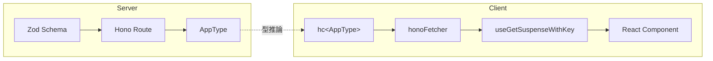

# Hono RPC + SWR Suspense Pattern

Hono RPC と SWR を組み合わせた型安全な API 統合パターンの最小実装。

## パターンの核心

- [fetcher.ts](client/src/lib/api/fetcher.ts) - Hono RPC 専用フェッチャー
- [use-get-suspense.ts](client/src/lib/api/use-get-suspense.ts) - Suspense 対応 SWR フック

## 型の流れ



## セットアップ

```bash
pnpm install
pnpm dev
```

## ディレクトリ構成

```text
├── client/
│   └── src/
│       ├── lib/api/          # fetcher, use-get-suspense ←ここが核心
│       └── features/users/   # 使用例
└── server/
    └── src/
        ├── routes/           # API エンドポイント
        └── schemas/          # Zod スキーマ
```
